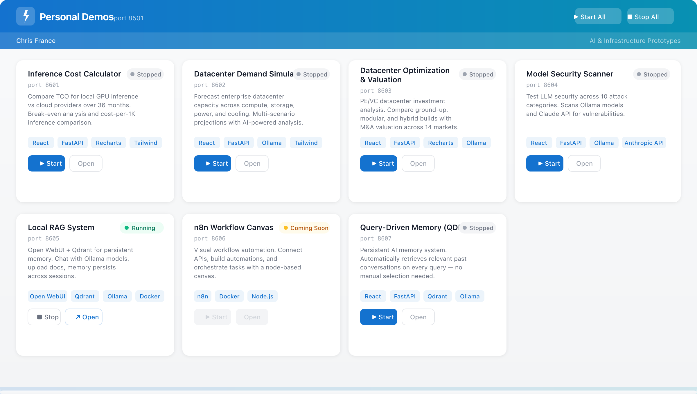

# AI Public Prototypes

**A portfolio of AI demo applications — datacenter analytics, security testing, RAG systems, and workflow automation.**

Each project runs locally and is designed to showcase practical AI capabilities for enterprise use cases. Most use [Ollama](https://ollama.ai) for local LLM inference — no cloud API keys required unless noted.



---

## Projects

| Project | Description | Tech |
|---------|-------------|------|
| [AI Inference Cost Calculator](ai-inference-cost-calculator/) | GPU vs cloud TCO comparison over 36 months with break-even analysis | React, FastAPI, Recharts, Tailwind |
| [Datacenter Demand Simulator](datacenter-demand-simulator/) | Capacity forecasting across compute, storage, power, and cooling with AI-powered analysis | React, FastAPI, Recharts, Tailwind, Ollama |
| [Datacenter Optimization & Valuation](datacenter-optimization-valuation/) | PE/VC datacenter investment analysis with M&A valuation across 14 global markets | React, FastAPI, Recharts, Tailwind, Ollama |
| [Model Security Scanner](model-security-scanner/) | LLM vulnerability testing across 10 attack categories for Ollama and Claude models | React, FastAPI, Recharts, Tailwind, Ollama |
| [Local RAG System](local-rag-system/) | Private AI chat with persistent document memory — fully local, no API keys | Docker, Open WebUI, Qdrant, Ollama |
| [Query-Driven Memory](query-driven-memory/) | Persistent AI memory with automatic retrieval — memories reinforce with use and decay over time *(code available upon request)* | React, FastAPI, Tailwind, Qdrant, Ollama |
| [Personal Demo Launcher](personal-demo-launcher/) | Single dashboard to start, stop, and monitor all demo projects | React, FastAPI, Tailwind |

## Quick Start

Each project has its own README with setup instructions. The **Personal Demo Launcher** can manage all projects from a single dashboard:

```bash
cd personal-demo-launcher
bash run.sh
```

Opens at [http://localhost:8501](http://localhost:8501).

## License

[MIT](LICENSE)
